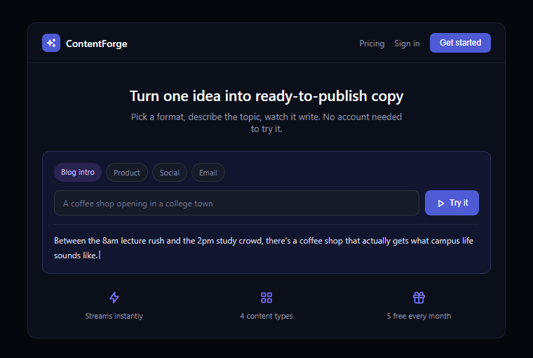
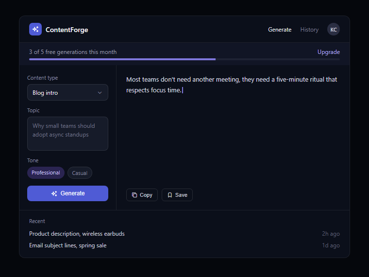

# ContentForge

An AI content generator with streamed OpenAI output, a Stripe-gated unlimited plan, and a free-tier monthly quota that stays correct under concurrent requests. Built with Next.js App Router, Supabase, the Vercel AI SDK, and Stripe.

[](https://github.com/Cina-ken/ai-content-generator/actions/workflows/ci.yml)

**Live app:** _add after deploy_



## Features

- **Live public demo**: pick a format, type a topic, watch it stream — no account required.
- **Streamed generation**: token-by-token output via the Vercel AI SDK (`streamText` + `useCompletion`), not a single delayed response.
- **Free-tier monthly quota**: 5 free generations a month, enforced atomically at the database layer (see [the hard part](#the-hard-part-atomic-quota-checking)).
- **Auth + per-user history**: email/password auth via Supabase, with Postgres Row Level Security so each user only ever sees their own generations.
- **Stripe subscriptions (test mode)**: hit the free cap and an inline paywall offers unlimited generations; checkout, billing portal, and webhook-driven subscription sync are all wired up end to end.
- **Rate-limited public demo**: the unauthenticated landing-page demo is capped per-browser via a cookie, with a per-IP counter as a secondary guard.

| Generate screen |
| --- |
|  |

## Architecture

```
Next.js App Router (Vercel)
├─ src/app/page.tsx                    → landing page, public, includes the live limited demo
├─ src/app/generate/page.tsx           → authenticated screen (form + streamed output + history)
├─ src/app/pricing/page.tsx            → upgrade page
├─ src/app/api/generate/route.ts       → POST, streams AI output, checks/increments quota atomically first
├─ src/app/api/demo/route.ts           → unauthenticated preview, cookie + per-IP rate-limited
├─ src/app/api/stripe/webhook/route.ts → checkout/subscription events → Supabase sync
├─ src/lib/supabase/{server,client,middleware,admin}.ts → SSR-aware Supabase clients + session refresh
├─ src/lib/stripe.ts, billing-actions.ts, subscription-sync.ts → Checkout Sessions, Billing Portal, webhook sync
├─ src/lib/quota.ts                    → atomic quota check-and-increment (see below)
└─ src/lib/generate.ts                 → content-type → prompt mapping

Supabase (Postgres + Auth)
├─ auth.users                          → email/password auth
├─ generations       (RLS: user_id = auth.uid())
├─ quota_counters    (RLS: select-only for user_id = auth.uid(); writes go through increment_quota() only)
└─ subscriptions     (RLS: select-only for user_id = auth.uid(); service-role writes only)
```

Auth state is refreshed on every request via Next.js middleware ([`src/proxy.ts`](src/proxy.ts) → [`src/lib/supabase/middleware.ts`](src/lib/supabase/middleware.ts)), so Server Components always see a valid session without a client-side round trip. `src/proxy.ts` (not `middleware.ts`) is intentional, not a typo: as of Next.js 16 the `middleware.ts` convention is deprecated in favor of `proxy.ts`, and Next.js 16.2.10 (this project's version) throws a build error if both exist. See [nextjs.org/docs/messages/middleware-to-proxy](https://nextjs.org/docs/messages/middleware-to-proxy).

The webhook handler ([`src/app/api/stripe/webhook/route.ts`](src/app/api/stripe/webhook/route.ts)) verifies the Stripe signature, then routes `checkout.session.completed`, `customer.subscription.updated`, and `customer.subscription.deleted` into `syncSubscriptionToSupabase`, using `metadata.supabase_user_id ?? client_reference_id` as the user-id fallback so a webhook lookup never depends on a single field being present.

## The hard part: atomic quota checking

Quota enforcement has a check-then-act race condition. If a signed-in user on the free plan fires two generation requests close together, both could read "4 of 5 used" before either one writes back "5 of 5" — letting them slip past the cap. This isn't just a fairness bug: every generation call costs real OpenAI tokens, so an uncapped race is a real financial exposure.

The fix lives in `increment_quota()`, a `plpgsql` function (`supabase/schema.sql`) called via Supabase RPC from [`src/lib/quota.ts`](src/lib/quota.ts). Rather than a `SELECT count` followed by a separate `UPDATE`, it's a single atomic statement:

```sql
insert into quota_counters (user_id, month, count)
values (p_user_id, p_month, 1)
on conflict (user_id, month) do update
  set count = quota_counters.count + 1
  where quota_counters.count < p_limit
returning count into new_count;
```

The `insert ... on conflict ... where` form handles both cases — first generation of the month (no row yet) and every subsequent one — in the same statement, so there's no second window between "does a row exist" and "increment it." If the `where` clause blocks the update, `new_count` comes back `NULL`, and `checkAndIncrementQuota()` treats that as `allowed: false` *before* the OpenAI call is ever made.

I verified this directly rather than trusting it by inspection: I drove the counter to 4-of-5 for a real test user, then fired two genuinely concurrent HTTP requests at Supabase's REST RPC endpoint with `Promise.all`. Exactly one came back `5`; the other came back `null`; the stored count landed at exactly `5`, not `6`. The same test with the requests spaced apart (no race) also correctly blocks the 6th call. Getting this wrong in either direction is a real failure mode — too loose and a user can generate for free past the cap at OpenAI's expense; too strict (e.g. checking and incrementing as two steps with a lock held too briefly) and a legitimate 5th request gets rejected.

## Tech stack

Next.js 16 (App Router) · React 19 · TypeScript · Tailwind CSS · Supabase (Postgres, Auth, RLS) · Stripe · Vercel AI SDK (`ai`, `@ai-sdk/openai`) · OpenAI `gpt-4o-mini` · Vitest

## Getting started

```bash
git clone https://github.com/Cina-ken/ai-content-generator.git
cd ai-content-generator
npm install
cp .env.example .env.local   # fill in the values below
npm run dev
```

Open [http://localhost:3000](http://localhost:3000).

### Environment variables

| Variable | Used for |
| --- | --- |
| `NEXT_PUBLIC_SUPABASE_URL` | Supabase project URL |
| `NEXT_PUBLIC_SUPABASE_ANON_KEY` | Supabase anon/public key (client + SSR) |
| `SUPABASE_SERVICE_ROLE_KEY` | Server-only key that bypasses RLS; used by `increment_quota()` calls and the Stripe webhook |
| `OPENAI_API_KEY` | Model calls via the Vercel AI SDK's `@ai-sdk/openai` provider |
| `STRIPE_SECRET_KEY` | Server-side Stripe API calls |
| `NEXT_PUBLIC_STRIPE_PUBLISHABLE_KEY` | Stripe.js on the client |
| `STRIPE_WEBHOOK_SECRET` | Verifies incoming Stripe webhook signatures |

Database side, run [`supabase/schema.sql`](supabase/schema.sql) in the Supabase SQL editor — it creates `generations`, `quota_counters`, `subscriptions`, and the `increment_quota()` RPC, each table with RLS enabled.

### Scripts

```bash
npm run dev    # start the dev server
npm run build  # production build
npm run start  # run the production build
npm run lint   # eslint
npm test       # run the unit test suite (Vitest)
```

## Testing & CI

Unit tests cover the pure content-type/prompt mapping (`src/lib/generate.test.ts`) and the quota logic (`src/lib/quota.test.ts`) with a mocked Supabase client — including the case where the RPC itself errors, which must fail closed (throw) rather than silently falling back to "allowed." GitHub Actions ([`.github/workflows/ci.yml`](.github/workflows/ci.yml)) runs lint, tests, and a production build on every push and pull request.

## Deployment

Deployed on Vercel, connected directly to this repo's `main` branch (git-connected from the start, not deployed manually via CLI), with Stripe running in test mode.

## License

[MIT](LICENSE)
